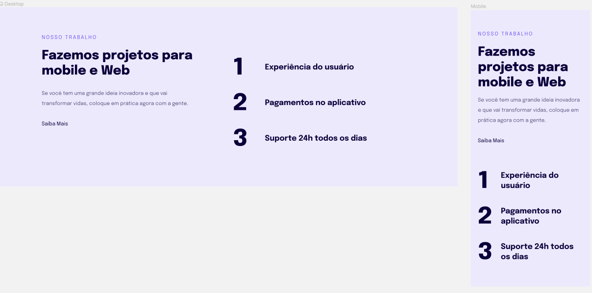

  

## 🖥️ Projeto
Resposividade.

## ✍️ Aprendizagem
* Introdução à responsividade
* Regra mobile-first
* Regra de unidades de medidas flexível
* Versão Desktop
* Fontes & cores

## 🚀 Tecnologias
Esse projeto foi desenvolvido durante o EXPLORER Programação Web da Rocketseat com as seguintes tecnologias:

* HTML
* CSS

## 🏷️ Layout
Você pode visualizar o layout do projeto através 
[desse link](https://www.figma.com/file/XTajC9NqosWQMXe7MTRmvX/Explorer-Stage-03-Projeto-02-(Copy)?type=design&node-id=203%3A412&t=vY4pXT4XR4fWBMi6-1). 
É necessário ter uma conta no [Figma](https://www.figma.com)

Feito com ❤️ por <strong>Luciana</strong>. Me acompanhe nas [redes sociais!](https://luciana-maria.github.io/Cartao-de-visita-Rocketseat/)
